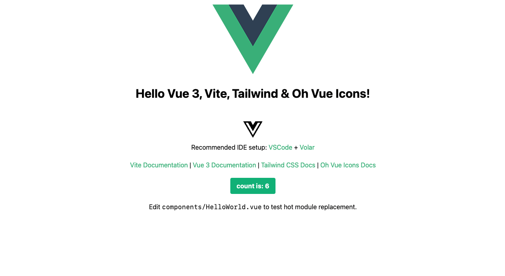

# Vue Tailwind Template

This is my personal template for a basic [Vue](https://vuejs.org/) + [Tailwind](https://tailwindcss.com/) + [Oh, Vue Icons!](https://oh-vue-icons.netlify.app/docs) application. It is, I hope, beginner friendly insofar as it contains basic examples of initial concepts, such as tailwind utility classes, `@layer components`, and how to import and use Oh Vue Icons.

## Documentation
- [Vue 3](https://v3.vuejs.org/guide/introduction.html)
- [Tailwind](https://tailwindcss.com/docs)
- [Oh Vue Icons!](https://oh-vue-icons.netlify.app/docs)
- [Icon Library](https://oh-vue-icons.netlify.app/icons)

## Vite

The project was initialised using [vite](https://vitejs.dev/), which means:

> This template should help get you started developing with Vue 3 in Vite. The template uses Vue 3 `<script setup>` SFCs, check out the [script setup docs](https://v3.vuejs.org/api/sfc-script-setup.html#sfc-script-setup) to learn more.

You do not have to use that, but it is available.

## Recommended IDE Setup

- [VSCode](https://code.visualstudio.com/) + [Volar](https://marketplace.visualstudio.com/items?itemName=johnsoncodehk.volar)

## Basic Usage

Clone this repository, then `npm install` to install the dependencies. The rest, as they say, I leave to you.